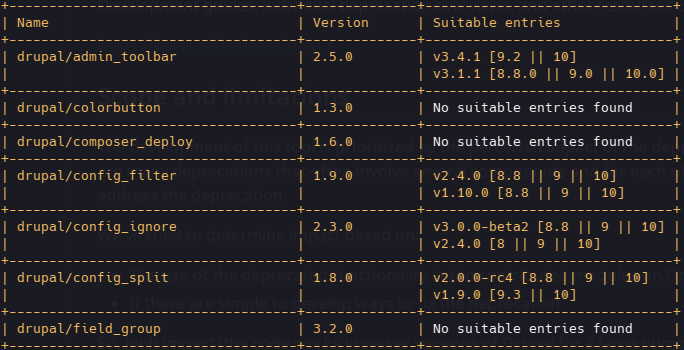

# Drupal Scout

Search for Drupal module entries with transitive core version requirements to help to upgrade the Drupal Core

## Installation

```bash
  pip install drupal-scout
```

## Features

- Use multithreading to speed up the process of searching for the Drupal module entries with transitive core version requirements.
- Choose between three output formats: table, json, and suggest.  
    - `table` format will output the data in the table format.  
    Example:
    
    - `json` format will output the raw data in the json format.  
    - `suggest` format will output the suggested composer.json file with the updated module version requirements.  
    It will also dump the suggested composer.json file to the specified path if the `--save-dump` argument is used.

## Limitations

- The application will only work with Composer-based (Composer v2) Drupal 8+ projects. 
    
## Usage/Examples

`drupal-scout [-h] [-d DIRECTORY] [-n] [-t THREADS] [-f {table,json,suggest}] [-s]`

### Arguments
&dash; `-h, --help` show this help message and exit  
&ndash; `-d DIRECTORY, --directory DIRECTORY`  Directory of the Drupal installation  
&ndash; `-n, --no-lock` Do not use the composer.lock file to determine the installed versions of the modules  
&ndash; `-t THREADS, --threads THREADS` The number of threads to use for the concurrent requests and data parsing. By default, the application will use the number of all available threads.  
&ndash; `-f {table,json,suggest}, --format {table,json,suggest}` The output format. By default, the application will use the table format.  
&ndash; `-s, --save-dump` Use in pair with `--format suggest` to dump the suggested composer.json file to the specified path. 